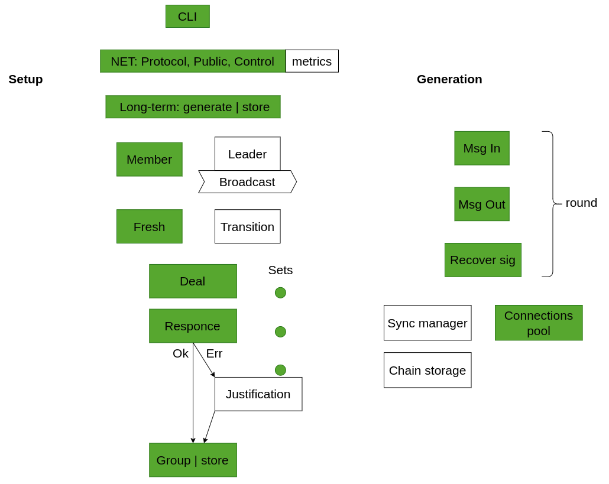

# drand-rs [WIP]

**Note: The project is currently at the prototype stage and does not contain full functionality. Codebase uploaded only for demonstration purpose. The main branch is configured to interact with [v1.5.8-testnet](https://github.com/drand/drand/releases/tag/v1.5.8-testnest). For production usage, please visit [Drand Golang implementation](https://github.com/drand/drand)**

**Update: dev branch for v2 is [here](https://github.com/storswiftlabs/drand-rs/tree/dev/v2)**

## Motivation
We aim to enhance the robustness and security of linked nodes by mitigating the risk of a single point of failure associated with software implementation. Additionally, we are exploring the opportunities of the system in terms of Rust language features.

## Functionality

- General picture of implemented modules mapped into [two phases of public randomness](https://github.com/drand/drand?tab=readme-ov-file#public-randomness). Aligned to be compatible with v1.5.8 drand golang implementation. 

 

## How to run:
Binaries in [make_demo](/make_demo/) folder can be reused or obtained in next 2 steps:
1. Compile project using one of the features to specify backend:
```bash
cargo build --release --features arkworks
# or
cargo build --release --features blstrs
```
2. Download golang binary [v1.5.8-testnest](https://github.com/drand/drand/releases/tag/v1.5.8-testnest) (tested on linux amd64)

Rename binaries into **drand_go** and **drand_rs** accordingly and place them into [make_demo](/make_demo/) folder.

Execute **./run** script to start Setup and Generation. Script configured to perform next scenario

 ```
 Setup and Generation: 

                  Group: 4 nodes                     Scheme              beacon id
           leader: golang impl (1 node)       pedersen-bls-chained          AAA
           members: rust impl  (3 nodes)      pedersen-bls-unchained        BBB
                                              bls-unchained-g1-rfc9380      CCC
```
   [video: 4 nodes group](https://drive.google.com/file/d/1visDx3lexfgcMEFi-adi0NtmPfsWFSFH/view?usp=drive_link)

Number of nodes can be modified for various scenaries, for example:
 ```
 Setup and Generation: 

                  Group: 4 nodes                     Scheme              beacon id
           leader: golang impl (1 node)       pedersen-bls-chained          AAA
           members: rust impl  (3 nodes)

                  Group: 7 nodes                     Scheme              beacon id
           leader: golang impl (1 node)       pedersen-bls-unchained        BBB
           members: rust impl  (6 nodes)     

                  Group: 10 nodes                     Scheme             beacon id
           leader: golang impl (1 node)       bls-unchained-g1-rfc9380      CCC
           members: rust impl  (9 nodes)   

```
   [video: 4-7-10 nodes group](https://drive.google.com/file/d/191rzucL5gX529J6PMfG5YfpZej6GoWQV/view?usp=drive_link)

## How to run Docker image 

Build the image 

```
docker build -t drand-rs .
```

Check if the image is created

```
docker images
```

Run the docker image 

```
docker run --rm -it drand-rs 
#or
docker compose up
```

