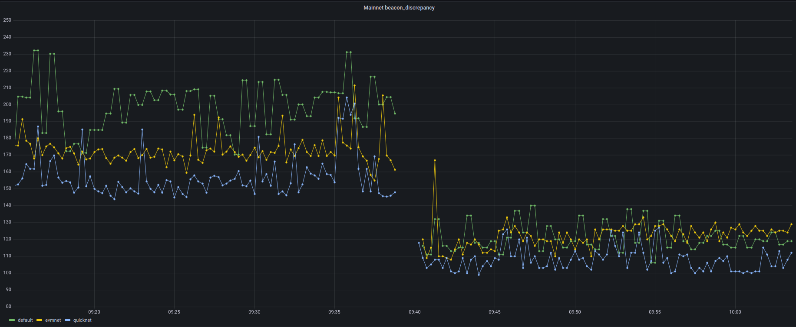
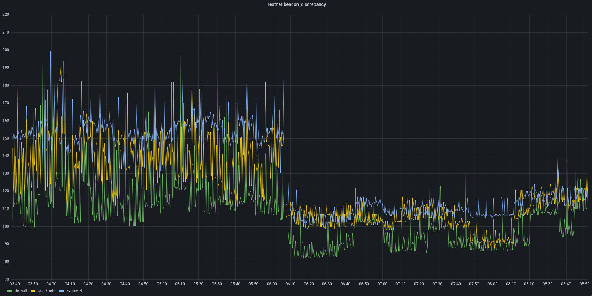

# Drand-rs (BETA)
> **Status:** This project has reached beta stage! We're seeking community feedback! Please create an issue if you encounter any problems or submit PRs.

A Distributed Randomness Beacon Daemon written in Rust.

Built for speed and lowest latencies for [League of Entropy] (LoE) voluntary consortium. Read more about Drand in the [official documentation](https://docs.drand.love/about/).

## Compatibility
Drand-rs is designed to be fully compatible with [Drand Go implementation] for setup and public randomness generation within the same group. For convenience, implementation in Rust uses the same CLI and produces similar log output for all operational workflows.

## Functionality
Phases for [Setup and Generation] are fully implemented for member nodes, please check [CLI](#cli) for more details.  

**Planned**  
Public interface for http-relays (post-beta)  

**Not Planned**  
Leader functionality - DKG protocol requires a coordinator to initialize proposal and rebroadcast packets during `setup` phase. This functionality is only needed from a single node within a group and remains specific to the Drand Go implementation.

## Key Advantages
Drand-rs is written using [Energon contracts] to dispatch schemes statically. This design enables experimentation with pluggable backends (trait implementors) for maximal performance.  
**Note:** All measurements were performed only by author using backend `[asm]`. See [runbook_beta](./runbook_beta.md) for instructions to reproduce.  

### Faster randomness delivery from node for relay providers.  
Beacon aggregates within 10ms after receiving the latest required sigshare. See [Backends & Statistic](#backends--statistic) for more information.  
Showcases for discrepancy metrics while switching to Drand-rs on Storswift LoE nodes.  

Mainnet node (Ubuntu, 2vCPU KVM Intel Xeon Platinum 8269CY 2.50 GHz, HT enabled)  
**Note:** Usage on Mainnet is discouraged until a security audit is conducted.
[](.assets/mainnet.png)  

Testnet node (Ubuntu, 1vCPU KVM Intel Xeon Platinum 8269CY 2.50 GHz, HT disabled)  
[](.assets/testnet.png)  

### Optimized sync manager to address issue [#1333](https://github.com/drand/drand/issues/1333)

Comparison for syncing 100000 rounds over TLS, total duration in seconds. 

| Beacon ID   | GO   | RS   | Speedup |
|-------------|------|------|---------|
| default     | 772s | 252s | 3.06x   |
| quicknet-t  | 646s | 225s | 2.87x   |
| evmnet-t    | 900s | 341s | 2.64x   |


## Backends & Statistic
To monitor [application-layer](/src/net/latency.rs) latency - add required `beacon_ids` at the end of `drand start` command. Events are logged at `debug` level, `--verbose` flag is required.  
```bash
# Example for LoE Testnet
$ drand start --verbose --folder /path/to/drand_rs/data --private-listen 0.0.0.0:8080 --metrics 0.0.0.0:22222 default quicknet-t evmnet-t 
```

We're sharing our latency measurements below as a reference point for the community. Your results may vary based on infrastructure and configuration.  

**Summary per backend:** LoE Testnet node. Duration: 24hours. Values in milliseconds.  

| Backend: crate (curve)                                 | Beacon ID  | P50 | P90 | P99 | min | max |
|--------------------------------------------------------|------------|-----|-----|-----|-----|-----|
| **asm:** [blstrs] (BLS12-381) + [arkworks_asm] (BN254) | default    | 4   | 4   | 7   | 3   | 14  |
|                                                        | quicknet-t | 3   | 3   | 5   | 3   | 11  |
|                                                        | evmnet-t   | 5   | 5   | 7   | 4   | 14  |
||
| **ark_asm:** arkworks_asm (BLS12-381, BN254)           | default    | 11  | 15  | 19  | 9   | 27  |
|                                                        | quicknet-t | 7   | 10  | 13  | 6   | 23  |
|                                                        | evmnet-t   | 5   | 6   | 8   | 4   | 22  |
||
| **default:** arkworks (BLS12-381, BN254)               | default    | 13  | 22  | 26  | 10  | 33  |
|                                                        | quicknet-t | 9   | 15  | 16  | 8   | 49  |
|                                                        | evmnet-t   | 6   | 9   | 10  | 5   | 34  |

## Dependencies
* Rust (toolchain version is specified in rust-toolchain.toml)
* [Protocol Buffers compiler]

## Build from source
For better performance in finite field and elliptic curve arithmetic - build with `asm` backend. Assembly instructions are available on most Intel and AMD `x86_64` platforms.

```bash
# Clone repository
$ git clone https://github.com/storswiftlabs/drand-rs.git

# Build with `asm` backend
$ RUSTFLAGS="-C target-feature=+bmi2,+adx" cargo build --no-default-features --features asm --release

# Build with `default` backend, if compatibility required
$ cargo build --release
```

## Make Demo
Run any interop test from CI, e.g. for `follow_chain` it will spawn required nodes, perform `setup` and `generation` with `sync`.  
See more in [tests](/src/test_with_golang). 
```bash
# All active LoE schemes are supported:
# - pedersen-bls-chained
# - bls-bn254-unchained-on-g1
# - bls-unchained-g1-rfc9380

# Example using bn254 scheme:
export DRAND_TEST_SCHEME=bls-bn254-unchained-on-g1
cargo test --features test-integration  -- test_with_golang::chain::follow_chain
```
## CLI
```console
drand - distributed randomness service

Usage: drand [OPTIONS] <COMMAND>

Commands:
  generate-keypair  Generate the long-term keypair (drand.private, drand.public) for this node, and load it on the drand daemon if it is up and running
  start             Start the drand daemon
  stop              Stop the drand daemon
  load              Load a stopped beacon from the filesystem
  sync              Sync your local randomness chain with other nodes and validate your local beacon chain. To follow a remote node, it requires the use of the 'follow' flag
  dkg               Commands for interacting with the DKG
  show              Local information retrieval about the node's cryptographic material and current state
  util              Multiple commands of utility functions, such as resetting a state, checking the connection of a peer...
  help              Print this message or the help of the given subcommand(s)

Options:
      --verbose  
  -h, --help     Print help
  -V, --version  Print version
```

## Author
Developed by [version513](https://github.com/version513) at [StorSwift](https://www.storswift.com/).

## Acknowledgments
Protocol details are based on the [Drand Go implementation](https://github.com/drand/drand). We're grateful to all its contributors for their work.

## License
Licensed under [Apache 2.0](LICENSE).

[League of Entropy]: https://en.wikipedia.org/wiki/League_of_Entropy
[Drand Go implementation]: https://github.com/drand/drand
[Setup and Generation]: https://github.com/drand/drand?tab=readme-ov-file#public-randomness
[Energon contracts]: https://github.com/version513/energon/blob/main/src/traits.rs
[blstrs]: https://github.com/filecoin-project/blstrs
[arkworks_asm]: https://github.com/filecoin-project/blstrs
[Protocol Buffers compiler]: https://protobuf.dev/downloads/